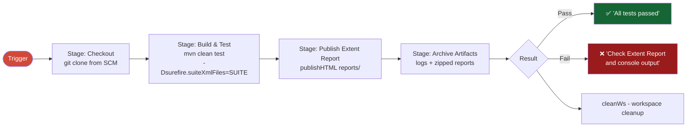

# 🚀 CI/CD Setup — Jenkins

This document explains how to set up Jenkins to run this framework — both using the **Declarative Pipeline** (Jenkinsfile) and the simpler **Freestyle** project.

---

## Option A: Pipeline (Recommended)

The repository includes a `Jenkinsfile` at the root for a fully declarative, code-as-infrastructure pipeline.

### Pipeline Architecture



### Prerequisites

Install these plugins in Jenkins:

| Plugin | Required For |
|---|---|
| **Pipeline** | Running the Jenkinsfile |
| **Git** | Cloning the repository |
| **Maven Integration** | Building with Maven |
| **HTML Publisher** | Publishing ExtentReport |
| **TestNG Results** | Publishing TestNG XML results |
| **Credentials Binding** | Injecting Stripe secrets |

### Step-by-Step Setup

#### 1. Configure Global Tools

Go to **Manage Jenkins → Global Tool Configuration**:

- **JDK**: Add JDK 21, name it exactly `JDK_21`
- **Maven**: Add Maven 3.x, name it exactly `Maven_3`

> The names must match exactly — they are referenced in the Jenkinsfile:
> ```groovy
> tools {
>     maven 'Maven_3'
>     jdk   'JDK_21'
> }
> ```

#### 2. Add Credentials

Go to **Manage Jenkins → Credentials → System → Global credentials → Add Credential**:

| Field | Value |
|---|---|
| Kind | Secret text |
| ID | `STRIPE_AUTH_KEY` |
| Secret | Your `sk_test_…` key |

Repeat for:

| ID | Secret |
|---|---|
| `STRIPE_AUTH_KEY` | Your Stripe test secret key |
| `STRIPE_MERCHANT_ACCOUNT_ID` | Your connected account ID (`acct_…`) |

> **Never put secrets in the Jenkinsfile or any source file.** They are injected via the Credentials Store.

#### 3. Create the Jenkins Job

1. Click **New Item**
2. Enter a name (e.g., `Stripe-API-Tests`)
3. Select **Pipeline**
4. Click **OK**

#### 4. Configure the Pipeline

In the job configuration:
- Under **Pipeline** → **Definition** → select **Pipeline script from SCM**
- **SCM**: Git
- **Repository URL**: your repo URL
- **Branch**: `*/main` (or your default branch)
- **Script Path**: `Jenkinsfile`

#### 5. Run a Build

1. Click **Build with Parameters**
2. From the **SUITE** dropdown, select which test suite to run:

```
testng.xml                      ← Full suite
testng-regression.xml           ← All regression
testng-smoke.xml                ← Quick sanity
testng-marketplace-e2e.xml      ← Marketplace flow
testng-subscription-e2e.xml     ← Subscription flow
testng-saved-card-e2e.xml       ← Saved card flow
testng-disputes-e2e.xml         ← Dispute flow
testng-idempotency.xml          ← Idempotency tests
testng-negative.xml             ← Negative tests
testng-flow.xml                 ← Core flow
testng-auth.xml                 ← Auth tests
```

3. Click **Build**

---

## Option B: Freestyle Project

If you prefer a simpler, GUI-based setup:

### Step-by-Step Setup

#### 1. Create the Job

1. Click **New Item**
2. Enter a name (e.g., `Stripe-API-Freestyle`)
3. Select **Freestyle project**
4. Click **OK**

#### 2. Source Code Management

- Select **Git**
- Enter your repository URL
- Set branch to `*/main`

#### 3. Add Build Parameters

Click **This project is parameterized** → **Add Parameter** → **Choice Parameter**:

| Field | Value |
|---|---|
| Name | `SUITE` |
| Choices (one per line) | `testng.xml` `testng-smoke.xml` `testng-regression.xml` ... |
| Description | TestNG suite to execute |

#### 4. Set Environment Variables

Under **Build Environment** → **Use secret text(s) or file(s)**:

| Variable | Credential ID |
|---|---|
| `STRIPE_AUTH_KEY` | `STRIPE_AUTH_KEY` |
| `STRIPE_MERCHANT_ACCOUNT_ID` | `STRIPE_MERCHANT_ACCOUNT_ID` |

#### 5. Add Build Step

Under **Build** → **Add build step** → **Invoke top-level Maven targets**:

| Field | Value |
|---|---|
| Goals | `clean test -Dsurefire.suiteXmlFiles=${SUITE}` |

#### 6. Add Post-Build Actions

- **Publish TestNG Results**: `**/target/surefire-reports/testng-results.xml`
- **Publish HTML Reports**: 
  - Report directory: `reports`
  - Report files: `ExtentReport_*.html`
  - Report title: `Extent Test Report`

---

## Jenkinsfile Reference

```groovy
pipeline {
    agent any
    tools {
        maven 'Maven_3'   // must match Global Tool name
        jdk   'JDK_21'   // must match Global Tool name
    }
    environment {
        STRIPE_BASE_URI            = 'https://api.stripe.com'
        STRIPE_AMOUNT              = '2000'
        STRIPE_AUTH_KEY            = credentials('STRIPE_AUTH_KEY')           // from Credentials Store
        STRIPE_MERCHANT_ACCOUNT_ID = credentials('STRIPE_MERCHANT_ACCOUNT_ID') // from Credentials Store
    }
    parameters {
        choice(
            name: 'SUITE',
            choices: ['testng.xml', 'testng-smoke.xml', ...],
            description: 'TestNG suite XML file to execute'
        )
    }
    stages {
        stage('Checkout') { steps { checkout scm } }
        stage('Build & Test') {
            steps {
                sh "mvn clean test -Dsurefire.suiteXmlFiles=${params.SUITE} --no-transfer-progress"
            }
            post {
                always {
                    testNG reportFilenamePattern: '**/target/surefire-reports/testng-results.xml'
                }
            }
        }
        stage('Publish Extent Report') {
            steps {
                publishHTML(target: [
                    reportDir: 'reports', reportFiles: 'ExtentReport_*.html',
                    reportName: 'Extent Test Report', keepAll: true, alwaysLinkToLastBuild: true
                ])
            }
        }
        stage('Archive Artifacts') {
            steps {
                archiveArtifacts artifacts: 'target/logs/**/*.log, reports/archive/*.zip',
                                 allowEmptyArchive: true
            }
        }
    }
    post {
        always { cleanWs() }
    }
}
```

---

## Reports in Jenkins

After each build:

| Report | Location in Jenkins |
|---|---|
| Extent HTML Report | Build → **Extent Test Report** (left sidebar) |
| TestNG Results | Build → **TestNG Results** (left sidebar) |
| Log files | Build → **Archived Artifacts** |

---

## Troubleshooting

| Problem | Cause | Fix |
|---|---|---|
| `mvn: command not found` | Maven not in PATH or not configured | Add Maven in Global Tool Configuration |
| `STRIPE_AUTH_KEY env var is not set` | Credential binding failed | Check Credential ID matches exactly |
| `balance_insufficient` on transfer | `source_transaction` not set | Verify `TransferTests.TC_01` uses `source_transaction` |
| All tests running despite selecting a specific suite | Using `-DsuiteXmlFile` (wrong) | Use `-Dsurefire.suiteXmlFiles` (plural) |
| HTML report not published | `allowMissing: true` needed | Ensure report was generated before the publish step |
