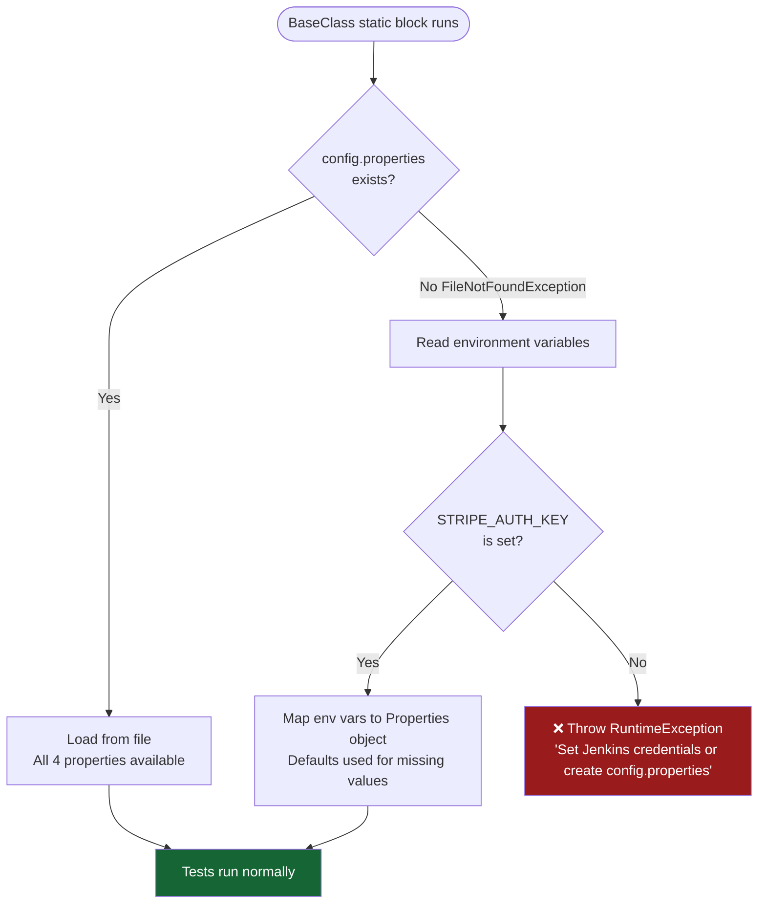

# ⚙️ Configuration Guide

This document covers every configuration option, environment variable, Stripe test token, and credential setup needed to run this framework.

---

## Local Development Setup

### `config.properties`

Create this file at `src/test/resources/config.properties`.

> ⚠️ **This file is in `.gitignore` and must NEVER be committed to version control.**

```properties
# Stripe API base URL (do not change for test mode)
baseURI=https://api.stripe.com

# Your Stripe test secret key (starts with sk_test_)
authKey=sk_test_51...YOUR_KEY_HERE

# The Stripe Account ID of your connected account (for transfer/payout tests)
# Format: acct_xxxxxxxxxxxx
merchant_account_id=acct_1T...YOUR_CONNECTED_ACCOUNT_ID

# Default payment amount in cents (2000 = $20.00 USD)
amount=2000
```

### Where to Find These Values

| Property | Where to Get It |
|---|---|
| `authKey` | Stripe Dashboard → Developers → API keys → Secret key (Test mode) |
| `merchant_account_id` | Stripe Dashboard → Connect → Accounts → click an account → copy Account ID |
| `baseURI` | Always `https://api.stripe.com` |
| `amount` | Any value in cents (minimum: 50 for USD) |

---

## CI / Jenkins — Environment Variables

When `config.properties` is not present (e.g., on a Jenkins agent), the framework automatically falls back to environment variables.



### Environment Variables Reference

| Variable | Required | Default | Description |
|---|---|---|---|
| `STRIPE_AUTH_KEY` | ✅ Yes | — | Stripe secret key (`sk_test_…`) |
| `STRIPE_MERCHANT_ACCOUNT_ID` | ✅ For connect tests | `""` | Connected account ID |
| `STRIPE_BASE_URI` | No | `https://api.stripe.com` | API base URL |
| `STRIPE_AMOUNT` | No | `2000` | Default payment amount in cents |

---

## Stripe Test Tokens

The framework uses Stripe's special test tokens to simulate different card behaviors.

### Card Tokens Used

| Token | Where Used | Behavior |
|---|---|---|
| `tok_bypassPending` | `PaymentMethodsHelper.createValidPaymentMethod()` | ✅ Funds settle to **available balance instantly** (no pending delay) |
| `tok_visa` | Negative/edge tests that need a standard card | Standard Visa, goes to pending balance |
| `tok_visa_chargeDeclinedInsufficientFunds` | `PaymentMethodsHelper.createInvalidPaymentMethod()` | ❌ Card declined — insufficient funds |
| `tok_visa_chargeDeclinedLostCard` | Negative data providers | ❌ Card declined — lost card |
| `tok_visa_chargeDeclinedExpiredCard` | Negative data providers | ❌ Card declined — expired card |
| `tok_visa_chargeDeclinedIncorrectCvc` | Negative data providers | ❌ Card declined — incorrect CVC |
| `tok_createDispute` | Dispute tests | ✅ Charge that auto-creates a dispute |

> **Why `tok_bypassPending`?**
>
> In Stripe test mode, regular card payments create a `pending` balance that takes simulated days to become `available`. Since payouts and transfers require `available` balance, using `tok_bypassPending` makes all test payments settle immediately — eliminating all `balance_insufficient` errors.

---

## `source_transaction` Pattern for Transfers

When creating a transfer to a connected account, the framework uses `source_transaction` to link the transfer directly to a specific charge:

```java
body.put("source_transaction", chargeId);  // chargeId = latest_charge on the PaymentIntent
```

This tells Stripe to fund the transfer from that specific charge, bypassing the platform account's general available balance entirely.

```
Without source_transaction:
  Transfer → deducted from platform available balance
  ❌ Fails with balance_insufficient if platform has no balance

With source_transaction:
  Transfer → funded directly from the specific charge
  ✅ Always succeeds regardless of platform balance
```

---

## Log Configuration

Logs are controlled by `src/test/resources/log4j2.xml`.

### Log Output Locations

| Location | Description |
|---|---|
| Console (`SYSTEM_OUT`) | Real-time output during test run |
| `target/logs/test_execution.log` | Current run's log file |
| `target/logs/archive/test_execution_<timestamp>.log` | One file per previous run |

### Log Levels

The root logger is set to `INFO`. To enable DEBUG logging, edit `log4j2.xml`:

```xml
<Root level="debug">
```

### Log Pattern

```
2026-07-04 12:30:00.123 [main] INFO  tests.InvoicesTest - TC_01_Create_Draft_Invoice
```

Format: `timestamp [thread] level class - message`

---

## ExtentReports Configuration

ExtentReports is configured in `listeners/ExtentReportListener.java`.

### Output

| File | Location |
|---|---|
| Current report | `reports/ExtentReport_yyyy-MM-dd_HH-mm-ss.html` |
| Previous reports (zipped) | `reports/archive/ExtentReport_<old-timestamp>.zip` |

### What's Captured

- ✅ PASS / ❌ FAIL / ⚠️ SKIP status per test
- Test name and class
- Exception messages and stack traces on failure
- Timestamps

---

## Maven Properties

Key Maven properties in `pom.xml`:

| Property | Value |
|---|---|
| `maven.compiler.source` | `21` |
| `maven.compiler.target` | `21` |
| `project.build.sourceEncoding` | `UTF-8` |

### Default Suite

The Surefire plugin is configured to run `testng.xml` by default:

```xml
<suiteXmlFiles>
    <suiteXmlFile>testng.xml</suiteXmlFile>
</suiteXmlFiles>
```

Override at runtime:
```bash
mvn clean test -Dsurefire.suiteXmlFiles=testng-smoke.xml
```

---

## Setting Up a Connected Account for Transfer/Payout Tests

If you don't have a connected account yet:

1. Go to **Stripe Dashboard → Connect → Accounts**
2. Click **+ Create** → Select **Express** or **Custom**
3. Complete minimal onboarding (test mode)
4. Copy the Account ID (format: `acct_xxxxxxxxxx`)
5. Add it to your `config.properties` as `merchant_account_id`

> The connected account must be in **test mode** and on the same Stripe test account as your `authKey`.
