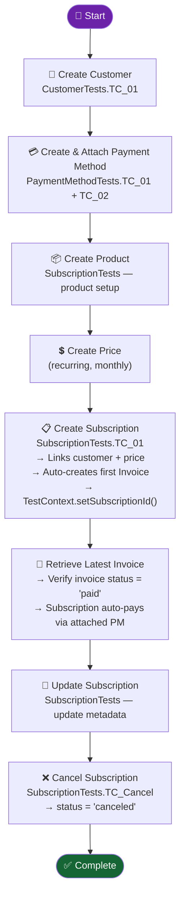
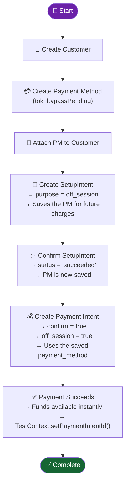
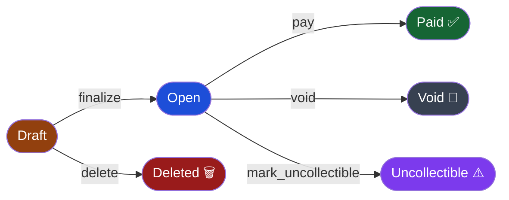
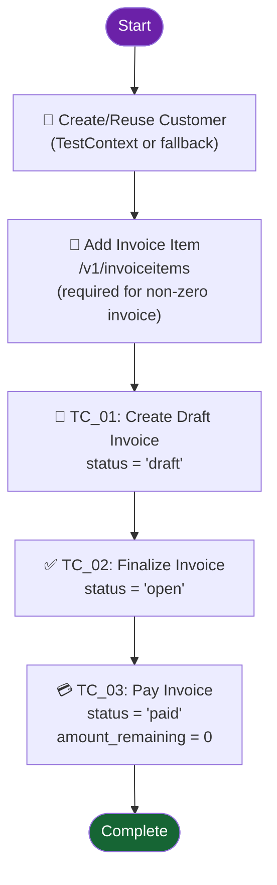
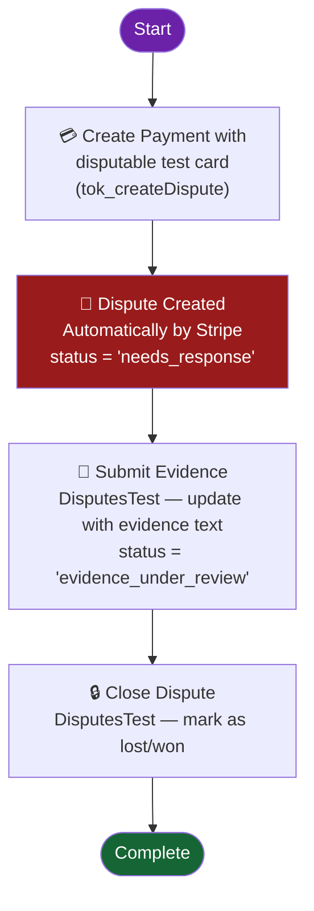
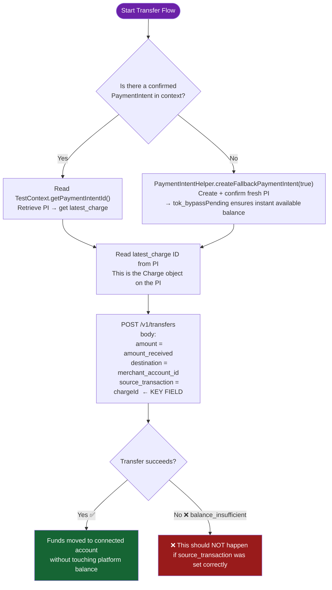
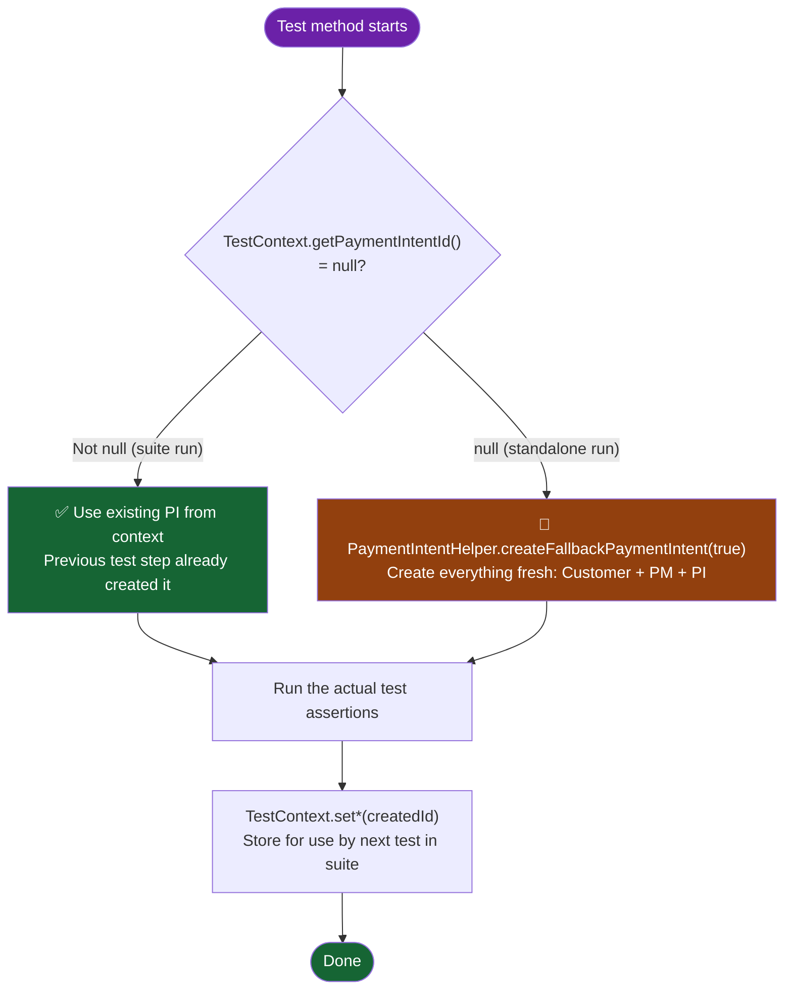
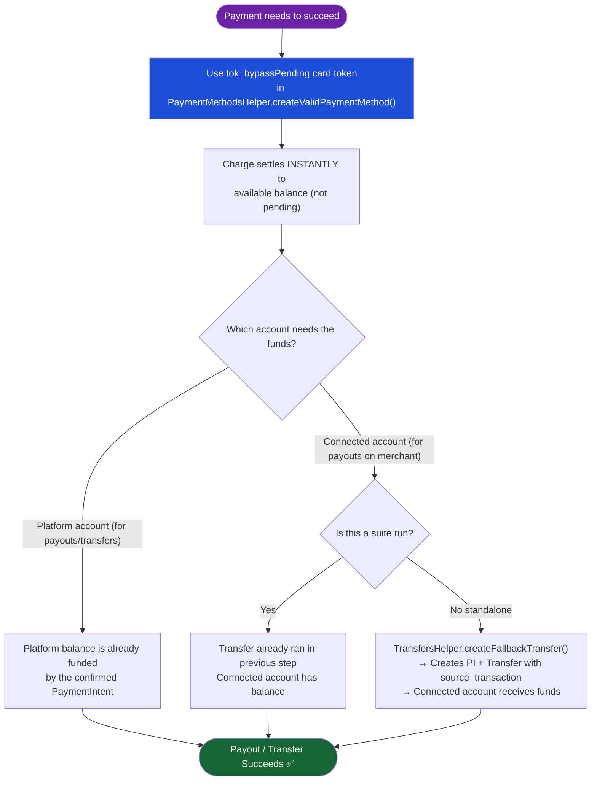

# 🔄 End-to-End Flow Diagrams

This document illustrates all the major end-to-end test flows in the framework.

---

## 1. Marketplace E2E Flow

**Suite:** `testng-marketplace-e2e.xml` | **Group:** `marketplace_e2e`

This is the primary flow simulating a full marketplace payment — from customer creation through payment, transfer to a connected merchant, payout, and refund verification via webhooks.

```mermaid
flowchart TD
    A([🚀 Suite Start]) --> B

    B["👤 Step 1 — Create Customer\nCustomerTests.TC_01\n→ TestContext.setCustomerId()"]
    B --> C

    C["💳 Step 2 — Create Payment Method\nPaymentMethodTests.TC_01\n→ TestContext.setPaymentMethodId()\nCard: tok_bypassPending"]
    C --> D

    D["📎 Step 3 — Attach Payment Method to Customer\nPaymentMethodTests.TC_02\n→ Links PM to customer"]
    D --> E

    E["🔧 Step 4 — Create SetupIntent\nSetupIntentTests.TC_01\n→ TestContext.setSetupIntentId()\n→ Saves card for future off-session use"]
    E --> F

    F["💰 Step 5 — Create PaymentIntent\nPaymentIntentTests.TC_01\n→ TestContext.setPaymentIntentId()"]
    F --> G

    G["✅ Step 6 — Confirm PaymentIntent\nPaymentIntentTests.TC_02\n→ Charge succeeds instantly (tok_bypassPending)\n→ Funds added to platform available balance"]
    G --> H

    H["🔍 Step 7 — Retrieve Charge\nSetupIntentTests.TC_15\n→ Verifies latest_charge on PI"]
    H --> I

    I["💸 Step 8 — Create Transfer\nTransferTests.TC_01\n→ source_transaction = latest_charge\n→ Funds move to connected account\n→ TestContext.setTransferId()"]
    I --> J

    J["🏧 Step 9 — Create Payout\nPayoutsTest.TC_01\n→ On connected account (Stripe-Account header)\n→ TestContext.setPayoutId()"]
    J --> K

    K["🔙 Step 10 — Create Refund\nRefundTests.TC_01 (partial)\n→ Refunds half the charged amount\n→ TestContext.setRefundId()"]
    K --> L

    L["🔔 Step 11 — Verify Webhook Events\nWebhookEventTests\n→ Asserts charge.refunded event\n→ Validates event object fields"]
    L --> M([✅ Suite Complete])

    style A fill:#6B21A8,color:#fff
    style M fill:#166534,color:#fff
    style G fill:#1D4ED8,color:#fff
    style I fill:#92400E,color:#fff
```

---

## 2. Subscription Billing E2E Flow

**Suite:** `testng-subscription-e2e.xml` | **Group:** `subscription_e2e`

---

## 3. Saved Card E2E Flow

**Suite:** `testng-saved-card-e2e.xml` | **Group:** `saved_card_e2e`

This flow demonstrates using a SetupIntent to save a card for off-session (recurring) payments.

---

## 4. Invoice Lifecycle Flow

**Suite:** `testng-invoices.xml` | **Group:** `invoice`

**Test flow:**

---

## 5. Dispute E2E Flow

**Suite:** `testng-disputes-e2e.xml` | **Group:** `disputes_e2e`

---

## 6. Transfer with `source_transaction` — Balance Safety

This pattern is used in `TransferTests.TC_01` and `TransfersHelper.createFallbackTransfer()` to avoid `balance_insufficient` errors in Stripe test mode.

---

## 7. Standalone vs. Suite Test Execution

Every test class is designed to run both independently and as part of a suite, using the fallback pattern.

---

## 8. Balance Management in Test Mode

Stripe test mode uses `pending` balance by default. These patterns ensure tests never hit `balance_insufficient`.

