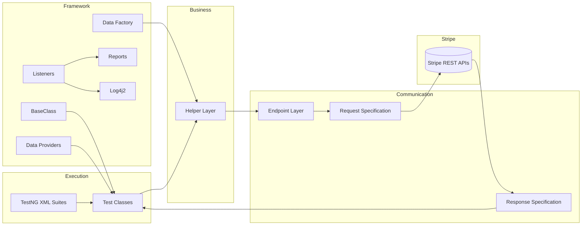
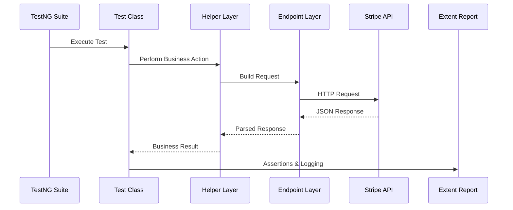
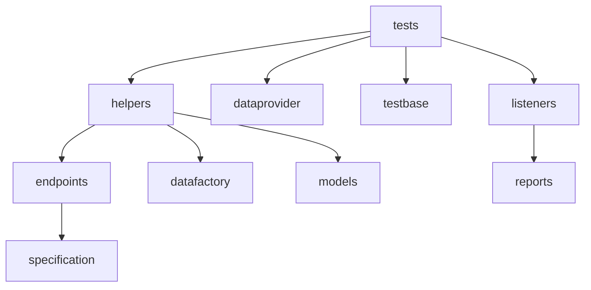

# 🏗️ Framework Architecture

> **"A scalable automation framework is not defined by the number of tests it contains, but by how easily new tests can be added without changing the existing architecture."**

Welcome to the architecture behind the **Stripe API Automation Framework**.

This document explains **how the framework is organized**, **why each layer exists**, and **how a single test travels through the entire system**—from execution to reporting.

Unlike traditional documentation that simply lists folders, this guide focuses on the engineering decisions behind the framework.

---

# 🎯 Design Philosophy

When building this framework, four principles guided every architectural decision:

* **Single Responsibility** – Every layer has one clear purpose.
* **Reusability** – Common functionality is written once and reused everywhere.
* **Scalability** – Adding new Stripe modules should require minimal changes.
* **Readability** – Test classes should describe business scenarios, not HTTP implementation.

The result is a modular framework where responsibilities are clearly separated and every component plays a specific role.

---

# 🧭 High-Level Architecture



---

# 🚀 The Journey of a Test

Let's follow a real execution through the framework.

Suppose the suite executes a test that creates a Payment Intent.

At first glance, it may appear that the test directly sends an HTTP request.

It doesn't.

Instead, the request passes through multiple specialized layers.



Each layer performs **one responsibility** before passing execution to the next.

This keeps the framework modular and maintainable.

---

# 🏛️ Framework Layers

## 1️⃣ Test Layer (`tests`)

This is the entry point of the framework.

The classes inside the `tests` package represent real business scenarios.

Examples include:

* Customer management
* Payment methods
* Payment intents
* Transfers
* Refunds
* Invoices
* Disputes
* Connected accounts

These classes answer one question:

> **What business scenario are we validating?**

They intentionally avoid low-level implementation details such as request construction or endpoint URLs.

---

## 2️⃣ Helper Layer (`helpers`)

The Helper Layer is where business workflows come together.

Rather than building payloads or handling responses directly inside test classes, reusable operations are encapsulated here.

For example, a helper may:

* Prepare request data.
* Invoke one or more endpoint methods.
* Extract useful values from responses.
* Reuse IDs across a workflow.
* Return simplified objects back to the test.

This keeps test classes focused on behavior instead of implementation.

---

## 3️⃣ Endpoint Layer (`endpoints`)

The endpoint layer is responsible for communicating with Stripe.

Its responsibilities include:

* Selecting the correct endpoint.
* Choosing the appropriate HTTP method.
* Sending the request.
* Returning the response.

This layer deliberately contains **no business logic**.

Its job is simply to communicate with the Stripe API.

---

## 4️⃣ Specifications (`specification`)

Every request sent to Stripe shares common configuration.

Instead of repeating headers, authentication, and content types throughout the framework, they are centralized in:

* `RequestSpec`
* `ResponseSpec`

This ensures consistency and reduces duplication.

---

## 5️⃣ Data Layer

The framework separates test data from test logic.

### Data Providers

The `dataprovider` package allows the same test to execute with multiple datasets.

Examples include:

* Valid inputs
* Invalid inputs
* Boundary values
* Multiple payment methods

### Data Factory

The `datafactory` package generates reusable request objects for different scenarios, making payload creation more organized and maintainable.

---

## 6️⃣ Models (`models`)

Stripe communicates using JSON.

Java works with strongly typed objects.

The model layer bridges this gap by representing request and response payloads as POJOs.

Benefits include:

* Cleaner payload construction.
* Type safety.
* Easier serialization and deserialization.
* Improved readability.

---

## 7️⃣ Base Framework (`testbase`)

The `BaseClass` provides the common foundation for all test classes.

Typical responsibilities include:

* Framework initialization.
* Shared configuration.
* Common setup and teardown.
* Environment preparation.

This avoids duplicating setup code across individual test classes.

---

## 8️⃣ Listeners (`listeners`)

The framework uses custom TestNG listeners to automate cross-cutting tasks such as:

* Report generation.
* Suite cleanup.
* Execution lifecycle management.

Because of this, reporting logic stays outside the test classes, keeping them clean and focused.

---

# 📁 Package Relationships



Each package depends only on the layers it needs, reducing unnecessary coupling.

---

# 🌱 How the Framework Scales

Adding support for a new Stripe API module follows a predictable pattern:

```text
Create Model
      │
      ▼
Create Endpoint
      │
      ▼
Create Helper
      │
      ▼
Create Test Class
      │
      ▼
Add to TestNG Suite
```

No existing modules need modification.

This design allows the framework to grow while remaining easy to maintain.

---

# 💡 Why This Architecture Works

Instead of combining business logic, HTTP communication, reporting, and data management inside every test class, the framework distributes these responsibilities across dedicated layers.

This provides several advantages:

* Tests remain short and readable.
* Business logic is reusable.
* API communication is centralized.
* Common configuration is defined once.
* New modules can be added with minimal effort.
* Maintenance costs remain low as the framework grows.

---

# 🏁 Final Thoughts

This framework is designed to be more than a collection of automated tests.

It is a reusable automation platform where each layer has a clear purpose and every component contributes to a scalable, maintainable architecture.

Whether adding a new Stripe API, introducing additional test scenarios, or integrating with CI/CD pipelines, the framework can evolve without requiring large-scale changes to the existing codebase.

The following documents build on this foundation by exploring the project structure, framework components, API coverage, business workflows, reporting, and design decisions in greater detail.
