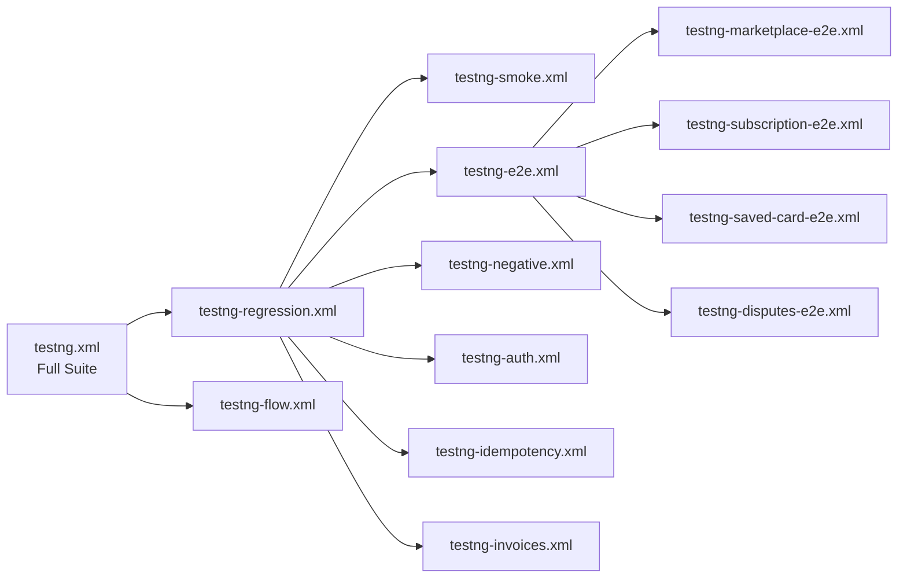

# 🧪 Test Suites & Test Case Inventory

This document lists every test suite, the groups they run, and the test cases covered.

---

## Suite Overview

---

## Suite Files

| Suite | Filename | Preserve Order | Thread Count | Description |
|---|---|---|---|---|
| Full | `testng.xml` | Partial | Default | Flow tests first, then all regression |
| Regression | `testng-regression.xml` | No | Default | All `regression` group tests |
| Smoke | `testng-smoke.xml` | No | Default | Quick pass/fail on happy paths |
| Flow | `testng-flow.xml` | Yes | 1 | Core user flow (customer → PI → refund) |
| E2E Combined | `testng-e2e.xml` | Yes | 1 | All E2E scenarios |
| Marketplace E2E | `testng-marketplace-e2e.xml` | Yes | 1 | 11-step marketplace payment |
| Subscription E2E | `testng-subscription-e2e.xml` | Yes | 1 | Subscription billing lifecycle |
| Saved Card E2E | `testng-saved-card-e2e.xml` | Yes | 1 | SetupIntent → future payment |
| Disputes E2E | `testng-disputes-e2e.xml` | Yes | 1 | Dispute workflow |
| Invoices | `testng-invoices.xml` | No | Default | Invoice lifecycle |
| Idempotency | `testng-idempotency.xml` | No | Default | Idempotency key tests |
| Negative | `testng-negative.xml` | No | Default | Invalid input / error tests |
| Auth | `testng-auth.xml` | No | Default | Authentication failure tests |

---

## TestNG Groups

| Group Name | Meaning |
|---|---|
| `regression` | Included in the main regression pass |
| `flow` | Core user flow, executed first in `testng.xml` |
| `smoke` | Minimal happy-path coverage |
| `negative` | Invalid inputs, expects 4xx responses |
| `auth` | Invalid/missing API key tests |
| `idempotent_test` | Tests that verify idempotency key behavior |
| `marketplace_e2e` | Steps in the marketplace E2E flow |
| `subscription_e2e` | Steps in the subscription E2E flow |
| `saved_card_e2e` | Steps in the saved card E2E flow |
| `disputes_e2e` | Steps in the dispute E2E flow |
| `invoice` | Invoice-specific tests |
| `unit` | Isolated unit tests that force `TestContext.clear()` |

---

## Test Case Inventory

### 👤 CustomerTests (30+ TCs)

| TC | Description | Groups |
|---|---|---|
| TC_01 | Create valid customer | regression, flow, marketplace_e2e |
| TC_02 | Retrieve customer | regression |
| TC_03 | Update customer (email, name, phone) | regression |
| TC_04 | Delete customer | regression |
| TC_05–TC_10 | Negative create (missing/invalid fields) | negative, regression |
| TC_11–TC_15 | Negative retrieve (invalid ID) | negative, regression |
| TC_16–TC_20 | Auth failure tests (invalid/missing key) | auth, regression |
| TC_21–TC_25 | Idempotency tests | idempotent_test |
| TC_26–TC_30 | List customers (filters, limits) | regression |

---

### 💳 PaymentMethodTests (20+ TCs)

| TC | Description | Groups |
|---|---|---|
| TC_01 | Create valid payment method (`tok_bypassPending`) | regression, marketplace_e2e |
| TC_02 | Attach payment method to customer | regression, marketplace_e2e |
| TC_03 | Retrieve payment method | regression |
| TC_04 | Detach payment method | regression |
| TC_05–TC_09 | Negative create (invalid token, missing type) | negative, regression |
| TC_10–TC_12 | Negative attach (invalid customer/PM IDs) | negative, regression |
| TC_13–TC_15 | Auth failure tests | auth, regression |
| TC_16–TC_20 | Retrieve by customer (positive + negative) | regression |

---

### 💰 PaymentIntentTests (20+ TCs)

| TC | Description | Groups |
|---|---|---|
| TC_01 | Create PaymentIntent | regression, flow, marketplace_e2e |
| TC_02 | Confirm PaymentIntent | regression, marketplace_e2e |
| TC_03 | Retrieve PaymentIntent | regression |
| TC_04 | Cancel PaymentIntent | regression |
| TC_05–TC_09 | Negative create (invalid amount, currency, PM) | negative, regression |
| TC_10–TC_12 | Negative confirm (already confirmed) | negative, regression |
| TC_13–TC_15 | Auth failure tests | auth, regression |
| TC_16–TC_18 | Idempotency tests | idempotent_test |
| TC_19 | Capture PaymentIntent (manual capture) | regression |

---

### 🔧 SetupIntentTests (30+ TCs)

| TC | Description | Groups |
|---|---|---|
| TC_01 | Create SetupIntent | regression, saved_card_e2e, marketplace_e2e |
| TC_02–TC_05 | Confirm with various payment methods | regression |
| TC_06 | Cancel SetupIntent | regression |
| TC_07 | Retrieve SetupIntent | regression |
| TC_08–TC_12 | Negative tests (invalid PM, already cancelled) | negative, regression |
| TC_13–TC_15 | Auth failure tests | auth, regression |
| TC_15 | Retrieve Charge on confirmed PI | marketplace_e2e |
| TC_16–TC_20 | Idempotency tests | idempotent_test |

---

### 📋 SubscriptionTests (25+ TCs)

| TC | Description | Groups |
|---|---|---|
| TC_01 | Create subscription | regression, subscription_e2e |
| TC_02 | Retrieve subscription | regression |
| TC_03 | Update subscription (metadata, trial end) | regression |
| TC_04 | Cancel subscription | regression |
| TC_05–TC_09 | Negative create (invalid customer, price) | negative, regression |
| TC_10–TC_12 | Auth failure tests | auth, regression |
| TC_13–TC_15 | Idempotency tests | idempotent_test |
| TC_16–TC_20 | List subscriptions | regression |

---

### 🧾 InvoicesTest (18 TCs)

| TC | Description | Groups |
|---|---|---|
| TC_01 | Create draft invoice | invoice, regression |
| TC_02 | Finalize invoice (draft → open) | invoice, regression |
| TC_03 | Pay invoice (open → paid) | invoice, regression |
| TC_04 | Retrieve invoice | invoice, regression |
| TC_05 | Update invoice description | invoice, regression |
| TC_06 | Void invoice (open → void) | invoice, regression |
| TC_07 | Mark invoice uncollectible | invoice, regression |
| TC_08 | Delete draft invoice | invoice, regression |
| TC_09 | Send invoice | invoice, regression |
| TC_10 | Negative: invalid creation payloads (data-driven) | invoice, negative, regression |
| TC_11 | Negative: invalid invoice IDs (data-driven) | invoice, negative, regression |
| TC_12 | Negative: finalize already-open invoice | invoice, negative, regression |
| TC_13 | Negative: void a draft invoice | invoice, negative, regression |
| TC_14 | Negative: delete an open invoice | invoice, negative, regression |
| TC_15 | Auth: invalid API key on create | invoice, negative, auth |
| TC_16 | Auth: missing API key on create | invoice, negative, auth |
| TC_17 | Auth: invalid API key on retrieve | invoice, negative, auth |
| TC_18 | Idempotency check | idempotent_test |

---

### 💸 TransferTests (15+ TCs)

| TC | Description | Groups |
|---|---|---|
| TC_01 | Create transfer with `source_transaction` | regression, marketplace_e2e |
| TC_02 | Retrieve transfer | regression |
| TC_03 | Create transfer reversal | regression |
| TC_04 | Retrieve transfer reversal | regression |
| TC_05–TC_09 | Negative: invalid amount, destination, currency | negative, regression |
| TC_10–TC_12 | Auth failure tests | auth, regression |
| TC_13–TC_15 | Idempotency tests | idempotent_test |

---

### 🏧 PayoutsTest (16+ TCs)

| TC | Description | Groups |
|---|---|---|
| TC_01 | Create payout (connected account) | payout, regression, marketplace_e2e |
| TC_02 | Retrieve payout | payout, regression |
| TC_03 | Cancel payout | payout, regression |
| TC_04–TC_09 | Negative: invalid currency, amount | negative, regression |
| TC_10–TC_12 | Auth failure tests | auth, regression |
| TC_13–TC_15 | Idempotency tests | idempotent_test |
| TC_16 | Idempotent create payout (platform account) | idempotent_test |

---

### 🔙 RefundTests (20+ TCs)

| TC | Description | Groups |
|---|---|---|
| TC_01 | Full refund of PaymentIntent | refund, regression, marketplace_e2e |
| TC_02 | Partial refund (half amount) | refund, regression |
| TC_03 | Cancel bank-transfer refund | refund, regression |
| TC_04 | Retrieve refund | refund, regression |
| TC_05–TC_09 | Negative: already refunded, invalid ID, over-refund | negative, regression |
| TC_10–TC_12 | Auth failure tests | auth, regression |
| TC_13–TC_15 | Idempotency tests | idempotent_test |

---

### ⚖️ DisputesTest (10+ TCs)

| TC | Description | Groups |
|---|---|---|
| TC_01 | Create/trigger dispute (via special test card) | disputes_e2e, regression |
| TC_02 | Retrieve dispute | regression |
| TC_03 | Submit evidence | disputes_e2e, regression |
| TC_04 | Close dispute | disputes_e2e, regression |
| TC_05–TC_07 | Negative: invalid dispute IDs | negative, regression |
| TC_08–TC_10 | Auth failure tests | auth, regression |

---

### 🔔 WebhookEventTests (5+ TCs)

| TC | Description | Groups |
|---|---|---|
| TC_01 | Verify `customer.created` webhook event | regression, marketplace_e2e |
| TC_02 | Verify `charge.refunded` event (reuses TestContext refundId) | regression, marketplace_e2e |
| TC_03 | Retrieve event by invalid ID | negative, regression |
| TC_04 | Auth failure on event retrieval | auth, regression |

---

### 🛡️ RadarTest (5+ TCs)

| TC | Description | Groups |
|---|---|---|
| TC_01 | Retrieve Early Fraud Warning | regression |
| TC_02 | List Early Fraud Warnings | regression |
| TC_03 | Negative: invalid EFW ID | negative, regression |

---

### 🏦 AccountTests + ConnectedAccountsTest (30+ TCs combined)

| TC Range | Description | Groups |
|---|---|---|
| TC_01–TC_05 | Create/retrieve platform account | regression |
| TC_06–TC_10 | Update account settings | regression |
| TC_11–TC_15 | Connected account: create, retrieve, update | regression |
| TC_16–TC_20 | Onboarding link generation | regression |
| TC_21–TC_25 | Negative: invalid account IDs | negative, regression |
| TC_26–TC_30 | Auth failure tests | auth, regression |
